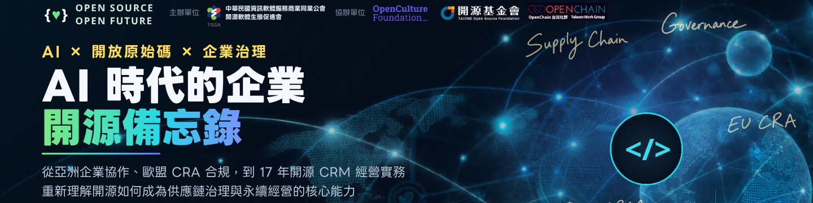
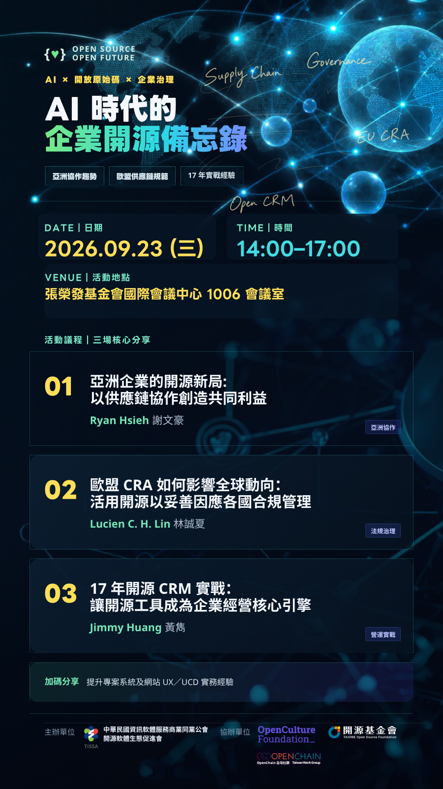
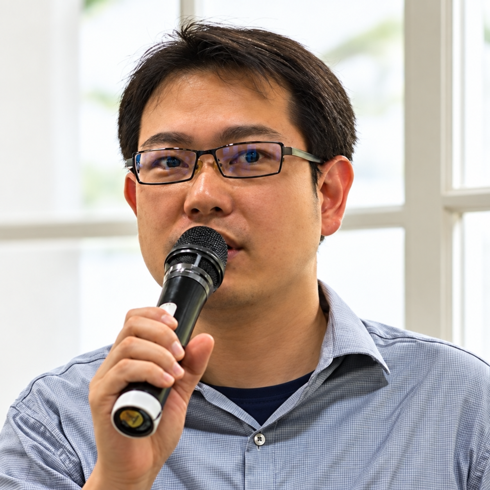

# AI 時代的企業開源備忘錄

撰文編輯／Ian Liu (Yanyiyi)

***活動主視覺。***

**亞洲協作趨勢、歐盟供應鏈規範到 17 年實戰**

當 AI 加速軟體開發，歐盟《網路韌性法案》（Cyber Resilience Act，CRA）也逐步上路，企業面對的已不只是「要不要使用開源」，而是如何管理開源軟體所連結的供應鏈、法規責任、社群協作與長期營運。

本次活動邀請三位分別來自企業開源治理、科技法律與開源商業實務領域的講者，從亞洲企業趨勢、歐盟法規影響及臺灣企業 17 年的營運經驗出發，帶領企業重新理解開放原始碼如何從技術工具，進一步成為跨組織協作、風險治理與永續經營的核心能力。

歡迎透過 [Google 表單報名](https://ggl.link/20260923)，也可以在表單中留下想向講者提出的問題。

## 活動資訊

* 日期：2026/09/23（三）
* 時間：14:00–17:00
* 地點：張榮發基金會國際會議中心 1006 會議室
* 主辦單位：中華民國資訊軟體服務商業同業公會／開源軟體生態促進會
* 協辦單位：開放文化基金會、開源基金會、OpenChain 台灣工作小組
* 報名方式：[Google 表單報名](https://ggl.link/20260923)

## 議程

| 時間 | 議程 |
| --- | --- |
| 14:00–14:10 | 活動開場與引言 |
| 14:10–14:55 | 亞洲企業的開源新局：以供應鏈協作創造共同利益 |
| 14:55–15:00 | 議程交流與 Q&A |
| 15:00–15:45 | 歐盟 CRA 如何影響全球動向：活用開源以妥善因應各國合規管理 |
| 15:45–15:50 | 議程交流與 Q&A |
| 15:50–16:00 | 提升專案系統及網站 UX／UCD 實務經驗分享 |
| 16:00–16:10 | 中場休息 |
| 16:10–16:55 | 17 年開源 CRM 實戰：讓開源工具成為企業經營的核心引擎 |
| 16:55–17:00 | 議程交流與 Q&A |

## 議程介紹

### 講題一｜亞洲企業的開源新局：以供應鏈協作創造共同利益

*從亞洲企業推動開源的趨勢與金融業實務出發，探討企業如何透過開源治理與供應鏈協作，降低重複投入及溝通成本，為企業、供應商與合作夥伴創造共同利益。*

時間：14:10–14:55

講者：Ryan Hsieh 謝文豪｜OSPOlogy Asia 2026 籌備暨議程委員｜企業開源治理實務工作者

開放原始碼在亞洲企業中的角色，正從工程團隊使用的技術工具，逐漸走向企業策略、跨部門治理與供應鏈協作。面對 AI、軟體供應鏈安全及國際法規帶來的新挑戰，企業不只需要管理自身使用的開源元件，也需要與供應商、客戶及開源社群建立更透明、更有效率的合作關係。

本場將從亞洲企業推動開源的發展趨勢出發，結合大型金融企業的實務經驗，探討企業如何跨越部門及組織邊界，透過開源治理與供應鏈協作，降低重複投入與溝通成本，累積共同維護的技術能力，進一步為企業、供應商與合作夥伴創造共同利益。

### 講題二｜歐盟 CRA 如何影響全球動向：活用開源以妥善因應各國合規管理

*結合從開源社群出發到企業輔導的經驗，說明歐盟 CRA 如何影響全球產品與供應鏈管理，以及企業如何正確理解開源、調整內部政策，妥善銜接各國合規要求。*

時間：15:00–15:45

講者：林誠夏 Lucien C. H. Lin｜群牧開源管理顧問有限公司負責人｜OSLN.tw 台灣開源法律網絡共同創辦人

歐盟《網路韌性法案》（Cyber Resilience Act，CRA）的影響不只限於歐洲，也正牽動全球企業的產品開發、軟體供應鏈及合規管理。對企業而言，開源不只是授權或法遵問題，更是產品與技術發展過程中的一種選擇。企業若能真正理解開源社群的運作方式，並依照自身需求調整管理策略，便能找到更適合長期發展的路線。

本場將結合講者長期參與開源社群及企業輔導的經驗，分享以歐盟為主要出貨市場的企業，如何在外部稽核團隊未充分理解開源運作的情況下，透過教育訓練重新釐清 CRA 中的開源條款，進一步調整內部管理政策，快速銜接後續合規要求，並將開源從潛在風險轉化為企業可以妥善運用的策略資源。

### 講題三｜17 年開源 CRM 實戰：讓開源工具成為企業經營的核心引擎

*當開源工具從一項技術選擇，化成企業長期經營的基礎，關鍵不只在於採用什麼技術，更在於如何從社群貢獻中，累積專業、深化客戶及社群關係，形成可持續成長的營運模式。*

時間：16:10–16:55

講者：Jimmy Huang 黃雋｜網絡行動科技股份有限公司（NETivism）共同創辦人

網絡行動科技自 2009 年成立以來，持續投入開源 CRM、網站服務及相關技術在臺灣非營利組織中的導入、在地化、維護與社群貢獻。走過 17 年，netiCRM 與 Drupal 對網絡行動而言，已不只是完成個別專案的技術工具，更是公司累積產業知識、發展服務模式、培養人才及深化客戶關係的重要基礎。

本場將從企業長期經營的角度出發，分享網絡行動如何在客戶需求、產品維護、中文在地化及開源社群貢獻之間做出選擇，並將長期投入開源所累積的技術與信任，逐步轉化為支持企業穩定營運及持續成長的核心能力。

當 AI 帶動新一波技術與市場變化，企業既要掌握新的發展機會，也需要重新思考既有產品、服務及團隊能力的定位。Jimmy 將透過網絡行動的實務經驗，分享企業如何在技術演進與核心價值之間取得平衡，讓開源工具持續成為推動企業成長與社會影響力的引擎。

## 活動海報

***活動資訊與三場核心分享。***

## 講者介紹

  

    

      
    

    

      
Ryan Hsieh 謝文豪

      
OSPOlogy Asia 2026 籌備暨議程委員｜企業開源治理實務工作者

      
現於臺灣金融業推動企業 OSPO，專注於開源審查與治理、軟體供應鏈安全及社群協作，並參與 Linux Foundation OSPOlogy Asia 2026 籌備暨議程委員會，持續連結大型企業的開源實務與社群經驗。

    

  

  

    

      
    

    

      
林誠夏 Lucien C. H. Lin

      
群牧開源管理顧問有限公司負責人｜OSLN.tw 台灣開源法律網絡共同創辦人

      
科技法律背景，從中研院 OSSF 自由軟體鑄造場時，即參與開源授權條款相關在地化與研究。近年持續協助企業處理開源授權、智慧財產權及合規管理問題。

    

  

  

    

      
    

    

      
Jimmy Huang 黃雋

      
網絡行動科技股份有限公司（NETivism）共同創辦人

      
Jimmy 於 2009 年共同創辦網絡行動科技，長期以 netiCRM、Drupal 等開源技術協助臺灣非營利組織發展數位服務，並將產品維護、客戶服務與社群貢獻，轉化為兼顧開源理念及企業永續經營的服務模式。

    

  

## 開源治理系列專文

* [#01 OCF 正式加入 OSPO 聯盟！開源治理手冊是什麼？](https://ocf.tw/story/ospos-1-join-OSPO-alliance/)
* [#02 OSPO 正在集結中！來自世界各地的政府開源專案辦公室](https://ocf.tw/story/ospos-2-floss-pso-intl-network/)
* [#03 2026 Q1 開源合規與安全調查報告：臺灣企業準備好了嗎？](https://ocf.tw/story/ospos-3-taiwan-open-compliance-security-report-2026-q1/)
* [#04 開源不只是技術選擇：AI 時代企業布局國際競爭力的起點](https://ocf.tw/story/open-source-business-ai-competitiveness-2026/)
* [#05 OCF 前進 Sony 總部：台灣開源治理推動經驗如何與亞洲接軌？](https://ocf.tw/story/ospos-5-ospology-asia-sony-2026/)
* [#06 串連社群、產業和政府：OCF 在 OSPOlogy Asia 2026 的分享紀實](https://ocf.tw/story/ospos-6-start-before-formal-ospo/)
* [#07 AI 時代的企業開源備忘錄：亞洲協作趨勢、歐盟供應鏈規範到 17 年實戰](https://ocf.tw/story/ospos-7-enterprise-open-source-memo-2026/)
