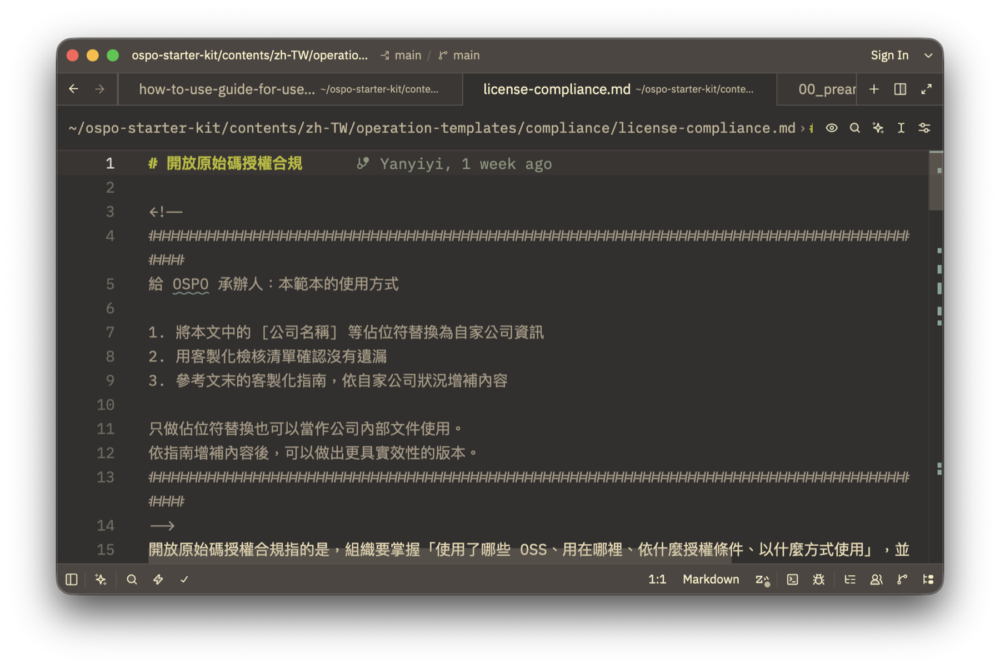
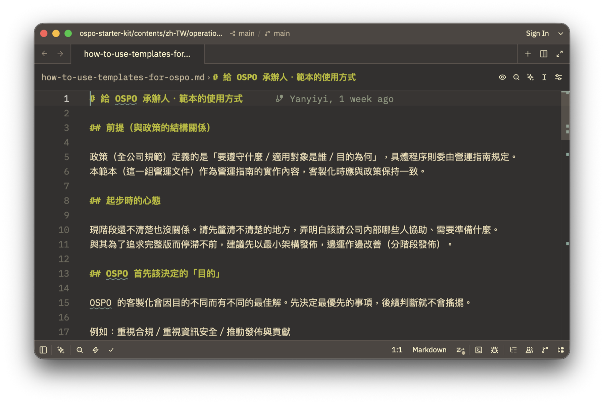
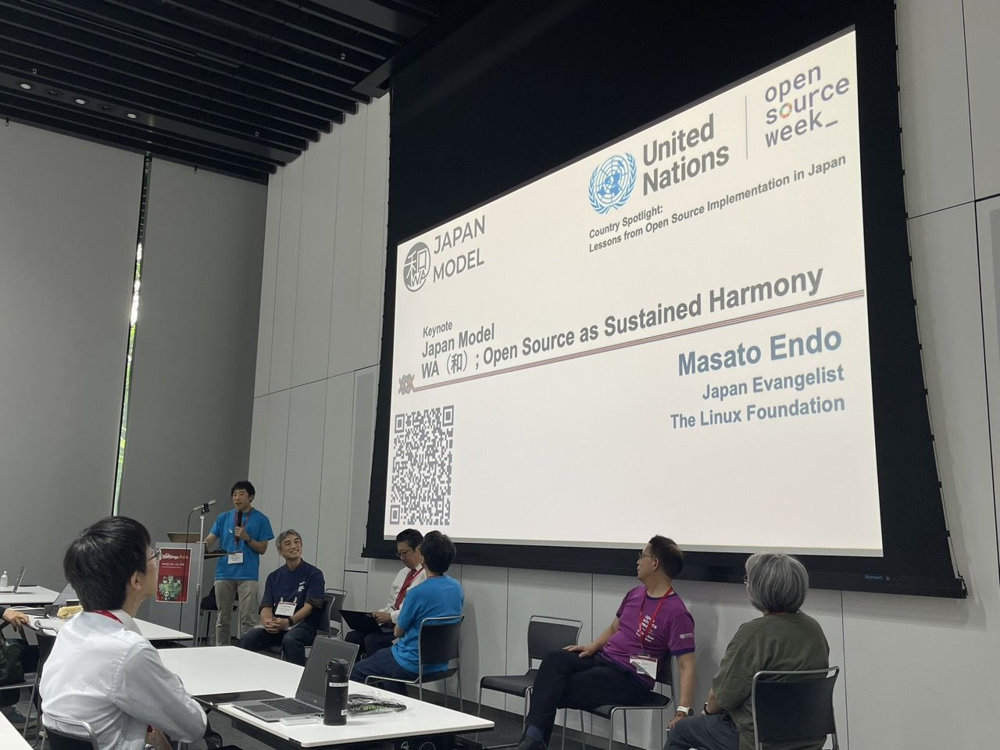
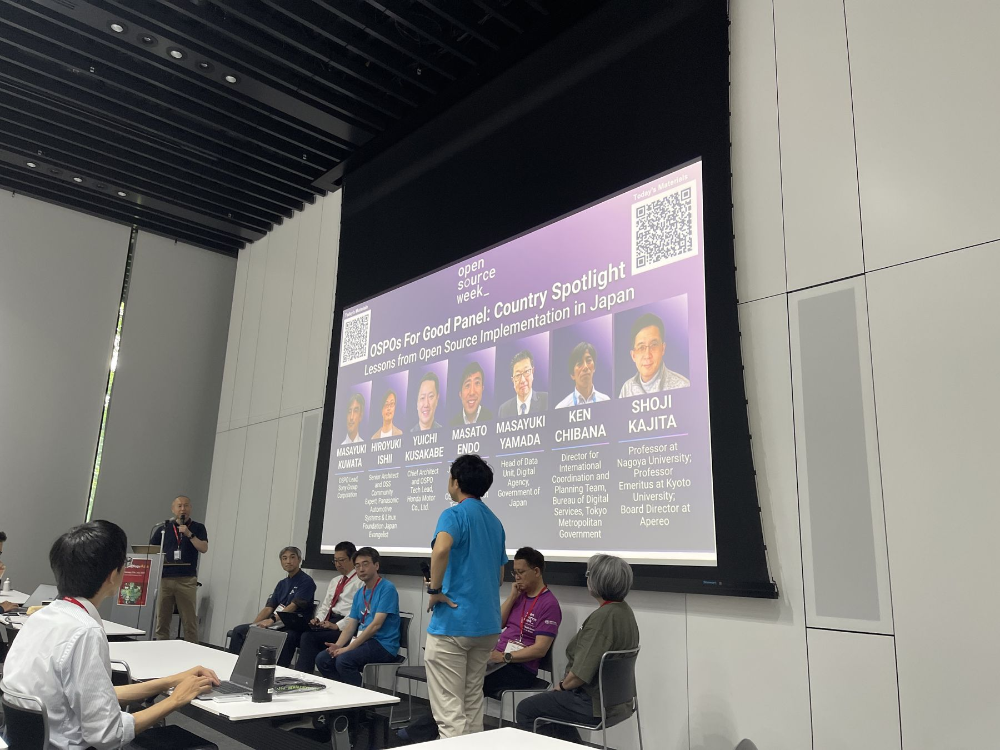
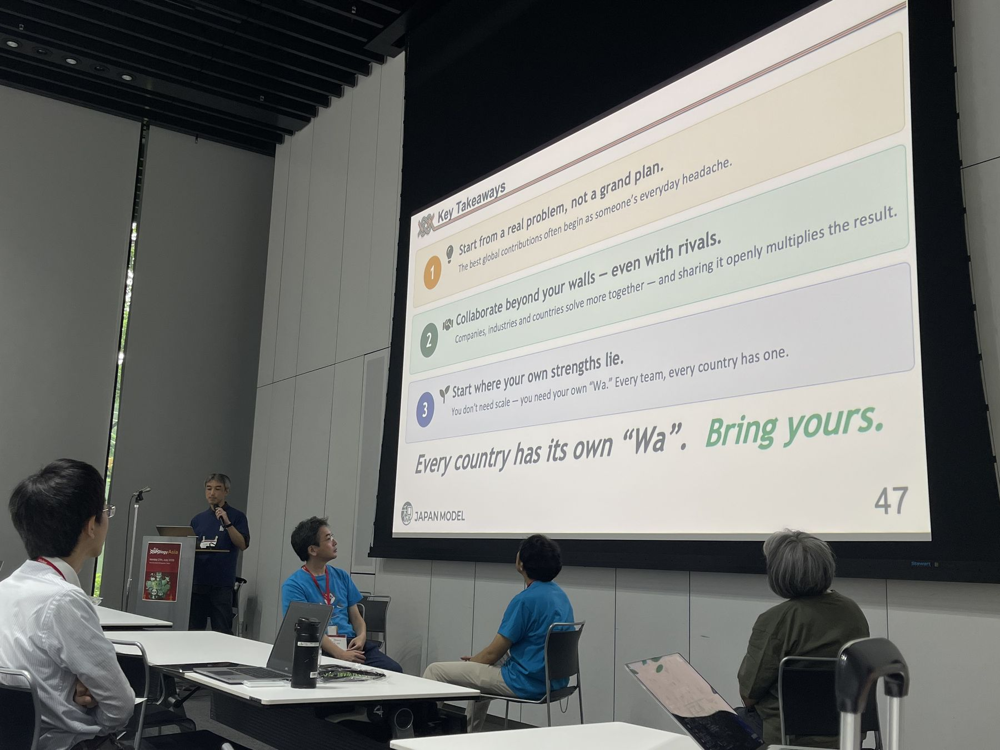
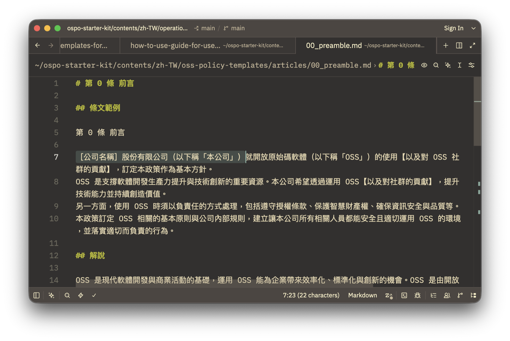
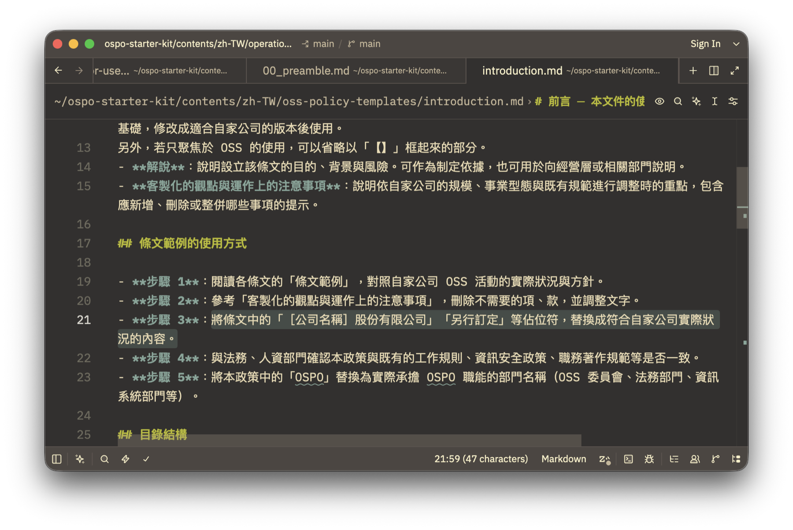
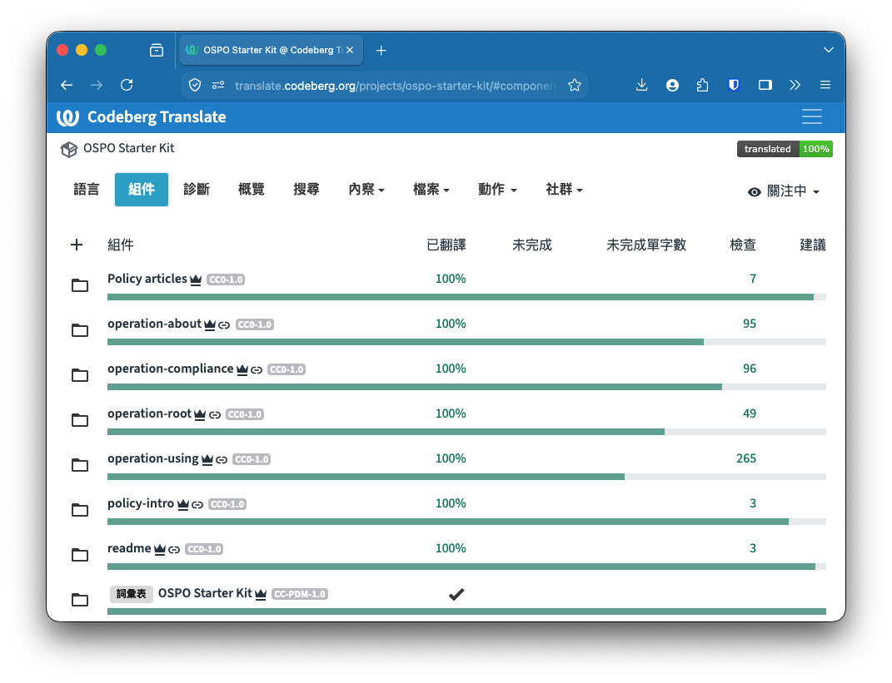

# 從「和」到一套能直接使用的文件：日本如何以 OSPO Starter Kit 支持產業

撰文／Ian Liu (Yanyiyi)

在東京參加 OSPOlogy Asia 時，最想帶回臺灣介紹的成果之一，是日本目前準備好給產業、學術或政府的這一整套寫好的文件。

當政府想支持產業建立開源治理能力，除了告訴企業「開源很重要」，還能實際做些什麼？日本的 [OSPO Starter Kit](https://github.com/japan-opensource-hub/ospo-starter-kit) 把企業可能需要的開源政策、授權合規、使用流程與內部說明文件先整理出來，讓組織不用從零開始。

前面的[#5](https://ocf.tw/story/ospos-5-ospology-asia-sony-2026/)介紹了 OSPOlogy Asia，[#6](https://ocf.tw/story/ospos-6-start-before-formal-ospo/)則分享 OCF 在研討會中的分享，如何在企業、政府與開源社群之間進行轉譯和陪伴。
而這一篇想從日本帶來的這套文件繼續往下看：國家層級的開源推動，最後可以怎麼落到企業真的拿得到、用得上的地方。

## 一整套公司可用的文件

OSPO Starter Kit 是由日本獨立行政法人情報處理推進機構（IPA）發行的 OSPO 文件套件，目前仍是持續發展中的草案版本。

IPA 是日本支援資訊產業、資訊安全與數位人才發展的重要公法人，部分功能可以類比臺灣的資策會，但兩者的法律定位與任務並不完全相同。IPA 近年透過 [Japan Open Source Hub](https://www.ipa.go.jp/digital/kaihatsu/oss/index.html)，將開放原始碼放進技術自主、軟體工程轉型與人才培育的脈絡中；除了進行調查、舉辦工作坊，也把實作成果整理成產業可以使用的材料。

OSPO Starter Kit 就是其中一項成果。除了「成立 OSPO 前請確認以下事項」檢查表外，還包含兩大類文件：

* **全公司適用的 OSS 政策範本**：從政策目的、適用範圍與 OSPO 職責，到 OSS 的使用、貢獻、對外釋出、員工個人參與、商標、授權事件、安全漏洞、紀錄及教育訓練等內容。
* **放進公司內部入口網站的操作文件**：包含開放原始碼基礎介紹、OSPO 與 InnerSource、授權類型與常見問題、OSS 清冊、評估方式，以及從供應商取得 OSS 時需要注意的事項。

***OSPO Starter Kit 的範圍不只有建立 OSPO，也包含授權合規，以及組織如何訂定使用、貢獻與釋出 OSS 的政策。***

政策範本中的每一條，除了可以直接參考的條文，還附有背景解說、客製化方向與實際運作時的注意事項；操作文件也附有檢查清單和使用指南。整套文字以 CC0 提供，企業可以自由複製、修改，再放進自己的內部文件系統。

IPA 支持產業與政府的，並不僅是「多認識 OSPO」，而是連一家公司要如何開始寫政策、如何向內部同事說明，以及如何逐步建立流程，都先準備了一套可以動手修改的基礎。

***OSPO Starter Kit 分別為 OSPO 承辦人與一般使用者準備指南；承辦人版本提醒組織先決定推動目的，再依現況逐步發展。***

## 我喜歡用「和」來理解這份文件怎麼出現

在這次交流裡，我很喜歡用日本的「和」來理解他們正在建立的開源生態系。政府、企業與開源社群不是各做各的，而是把不同位置累積的經驗放在一起，整理成下一個組織也能接著使用的成果。

***OSPOlogy Asia 的 Japan Model 分享以「和」（Wa）說明開源如何成為一種持續的協作關係。***

在 IPA 的分享中，Kazuki Imamura 介紹了日本針對 OSPO 進行的調查、人才培育與工作坊，也說明 OSPO Starter Kit 如何成為這些工作的實際產出。這份文件的產出，除了 IPA 團隊，文件的撰寫與審查還有 GitHub Japan、Hitachi Solutions、Mitsubishi Electric、Socionext 等企業的參與。

***日本分享陣容涵蓋企業、開源社群、中央與地方政府及學界，也延續他們在 UN Open Source Week 的分享脈絡；OCF 再把這些現場觀察帶回臺灣。***

現場交流時，長期參與 OpenChain Japan Work Group 的 Ayumi Watanabe 也特別推薦臺灣一起使用這套文件，她已經先把文件翻譯成英文版了，而 OCF 能做的是用過往在地化及陪伴企業的經驗，將其在地化。也歡迎臺灣的企業與社群也可以先拿來試，再把實際遇到的問題帶回去。[OpenChain](https://openchainproject.org/) 是 Linux Foundation 旗下開源供應鏈信任安全與標準的專案，透過日本、韓國、臺灣等地的工作小組，讓企業實務者交流授權合規、安全治理與供應鏈協作經驗。

***每個國家都有自己的「和」之道。從真實問題開始、跨越組織邊界合作，再從自己的優勢出發，這也是日本場次留給大家的邀請。***

## 「佔位符」是這套文件很聰明的一個設計

實際打開文件後，我很喜歡其中一個設計：它先把一份公司文件寫到相當完整，再把需要由各組織自行決定的地方留下「佔位符」。

***公司需要思考與決定的地方都明確保留在 OSPO Starter Kit 裡，許多文件先替換公司名稱，就能成為內部討論的起點。***

使用者可以先替換公司名稱、主要使用技術、負責窗口、適用對象及內部流程等內容，得到一份能帶進公司開始討論的版本；接著再依照每份文件附上的解說、檢查清單與客製化指南，逐步確認它是否真的符合公司的工作方式。

***每一份文件都有明確的調整步驟，協助使用者檢查內容是否已經長成符合自己公司與部門的樣子。***

因此，佔位符不只是留幾格讓人填空。它反映了整套文件的設計精神：不要求每家公司從頭發明一次開源治理，也不假設同一份政策可以原封不動套用到所有組織。先提供一份完整基礎，再把真正需要公司回答的問題留下來。

目前，這套文件目前仍是草案，同時也提醒大家，也不是替換完公司名稱就代表完成治理或符合法規。正式採用前，仍需要讓公司的法務、智慧財產、資安、採購與工程團隊一起確認，並依實際流程調整。但至少，大家不必先花幾個月猜測「一份 OSS 政策到底應該長什麼樣子」。

## 把文件帶回臺灣，也一起把在地經驗放進去

回臺灣後，OCF 在和政府、企業及社群夥伴交流時，也多次分享 OSPO Starter Kit。大家的反應讓我更確定，很多組織不是不知道開源治理重要，而是手上缺少一份能直接打開、逐段討論的材料。

OCF 已經建立 [OSPO Starter Kit 的 Weblate 正體中文在地化專案](https://translate.codeberg.org/projects/ospo-starter-kit/)。懂日文或英文的朋友可以協助翻譯；熟悉企業流程、授權、採購或資安的朋友，可以一起確認用語和情境是否合理。即使你正在公司裡第一次接觸 OSPO，也可以幫忙指出哪些說明還不夠清楚。

***OSPO Starter Kit 的正體中文內容透過 Codeberg Translate（以 Weblate 建置）協作，完成翻譯後仍需要大家一起檢查與改進。***

期待這份文件在後去是真的有人拿去使用、修改，有機會也很期待各位企業夥伴，再把臺灣企業遇到的問題與做法帶回上游。
這也正是我喜歡的「和」：不是大家得出完全相同的答案，而是願意把各自走過的路，留成下一個人也能繼續往前的材料。

## 開源治理系列專文

* [#01 OCF 正式加入 OSPO 聯盟！開源治理手冊是什麼？](https://ocf.tw/story/ospos-1-join-OSPO-alliance/)
* [#02 OSPO 正在集結中！來自世界各地的政府開源專案辦公室](https://ocf.tw/story/ospos-2-floss-pso-intl-network/)
* [#03 2026 Q1 開源合規與安全調查報告：臺灣企業準備好了嗎？](https://ocf.tw/story/ospos-3-taiwan-open-compliance-security-report-2026-q1/)
* [#04 開源不只是技術選擇：AI 時代企業布局國際競爭力的起點](https://ocf.tw/story/open-source-business-ai-competitiveness-2026/)
* [#05 OCF 前進 Sony 總部：台灣開源治理推動經驗如何與亞洲接軌？](https://ocf.tw/story/ospos-5-ospology-asia-sony-2026/)
* [#06 串連社群、產業和政府：OCF 在 OSPOlogy Asia 2026 的分享紀實](https://ocf.tw/story/ospos-6-start-before-formal-ospo/)
* [#07 AI 時代的企業開源備忘錄：亞洲協作趨勢、歐盟供應鏈規範到 17 年實戰](https://ocf.tw/story/ospos-7-enterprise-open-source-memo-2026/)
* [#08 從「和」到一套能直接使用的文件：日本如何以 OSPO Starter Kit 支持產業](https://ocf.tw/story/ospos-8-japan-ospo-starter-kit/)
* [#09 讓麻瓜也看懂 SBOM：韓國 BomLens 如何從個人手上的風險介接到公司治理](https://ocf.tw/story/ospos-9-korea-bomlens/)

## 延伸閱讀與參與

* [OSPO Starter Kit 原始文件與貢獻入口](https://github.com/japan-opensource-hub/ospo-starter-kit)
* [一起參與 OSPO Starter Kit 正體中文在地化](https://translate.codeberg.org/projects/ospo-starter-kit/)
* [Japan Open Source Hub](https://www.ipa.go.jp/digital/kaihatsu/oss/index.html)
* [OSPOlogy Asia 議程與講者分享資料](https://github.com/todogroup/ospology/discussions/816)
