# 讓麻瓜也看懂 SBOM：韓國 BomLens 如何從個人手上的風險介接到公司治理

撰文／Ian Liu (Yanyiyi)

SBOM 常常對非開發者會是相對複雜的文件，而中文翻譯叫「SBOM 清單」或「SBOM 表」，也常會以為交付完文件就結束了。檔案交付了、生出來了，但打開以後，應該先處理哪一件事呢？

這次在 OSPOlogy Asia，SK Telecom 的 OSPO Manager Haksung Jang 分享了他們開源釋出的工具 [BomLens](https://github.com/sktelecom/bomlens)。當 SK Telecom 開始要求供應商提供 SBOM，真正接到要求的人可能沒有專門的資安團隊，也沒有一套容易使用的工具。

BomLens 就從這個落差出發。它不只協助產生 SBOM，也把元件、授權與已知漏洞整理成比較容易閱讀的介面，讓原本只存在於一大份資料裡的風險，成為使用者看得見、能開始處理的項目。

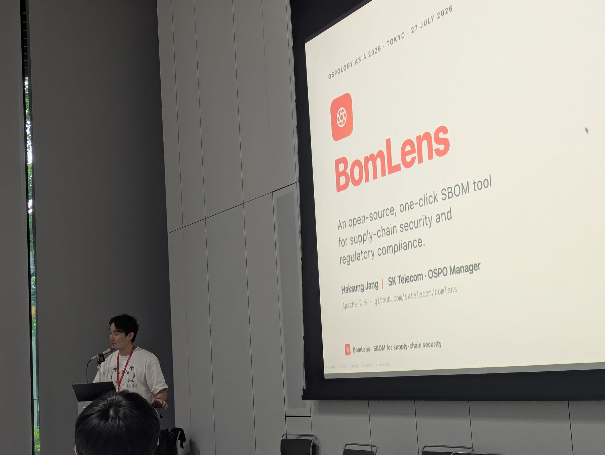
***SK Telecom OSPO Manager Haksung Jang 在 OSPOlogy Asia 2026 現場介紹 BomLens：一套協助供應鏈安全與合規的一鍵式開源 SBOM 工具。***

前面的[#5](https://ocf.tw/story/ospos-5-ospology-asia-sony-2026/)介紹 OSPOlogy Asia，[#6](https://ocf.tw/story/ospos-6-start-before-formal-ospo/)分享 OCF 如何串連企業、政府與開源社群。這一篇則想從韓國帶回另一個觀察：當企業對供應鏈提出新的要求，也需要讓真正執行的人有工具可以開始。

## 我真的拿自己的專案掃了一次

OCF 回臺灣後，只要和企業或社群夥伴談到 SBOM，我們幾乎都會順手打開 BomLens。不是因為它能一次解決所有合規問題，而是它很適合把對話從「我們應該開始管理」推進到「那就先掃一次看看」。

BomLens 提供 macOS 的 DMG 與 Windows 的 EXE 安裝檔，對於非開發者的好處在於不用先學會一串指令，就能在自己的電腦上開始操作。這讓每個人都可以在本地端，隨時掌握自己使用的專案有哪些開源元件、授權與安全問題。

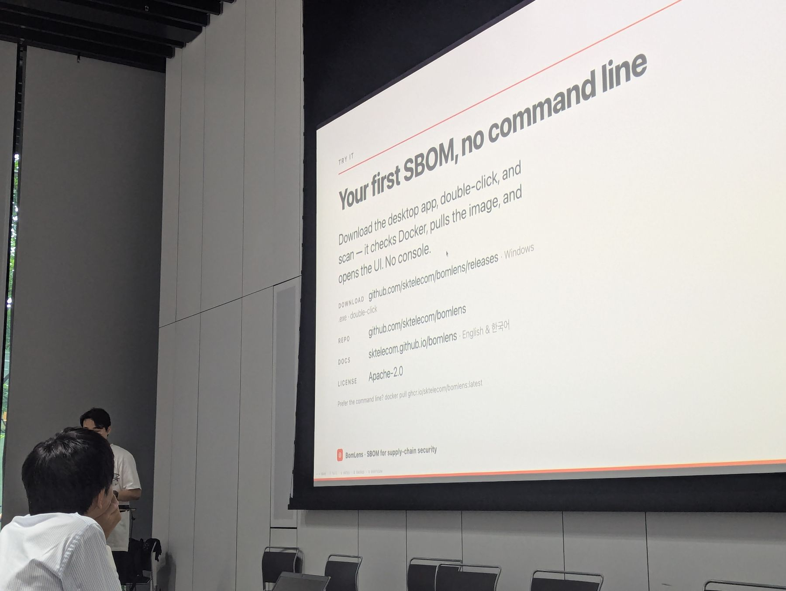
***現場示範強調，使用者下載桌面程式後便能以圖形介面產生第一份 SBOM，不需要先操作命令列。***

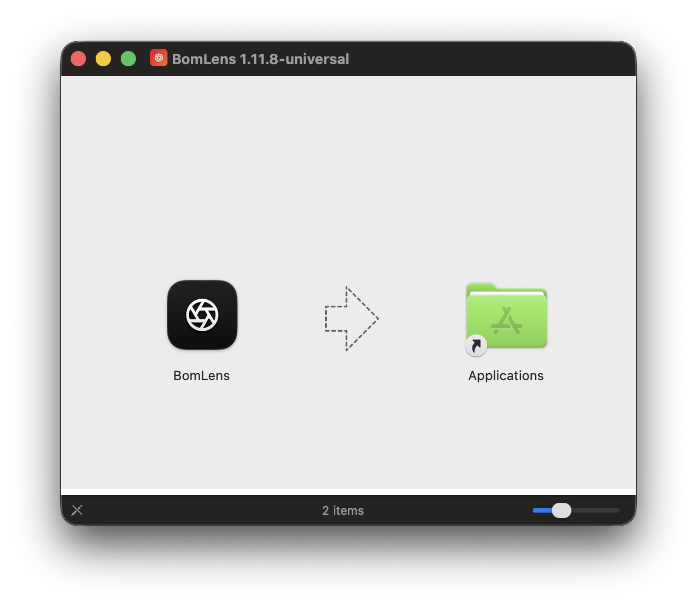
***BomLens 提供 macOS 的 DMG 與 Windows 的 EXE 安裝檔，讓每個人都能快速在本地端掌握專案的開源合規與安全狀態。***

我自己拿專案測試時，最有感的也不是它產生了多少份報告，而是修掉一個問題、重新掃描後，介面上的待處理項目和風險數字真的會跟著變化。你會很直接地知道：好，我剛才做的事情有用；也能看見下一個需要處理的問題在哪裡。

這種回饋對第一次接觸 SBOM 的人特別重要。使用者不必先學會閱讀整份 CycloneDX JSON，也不需要一開始就理解所有漏洞資料庫與授權分類，便能從「哪些項目需要注意」開始，一層一層往下看。

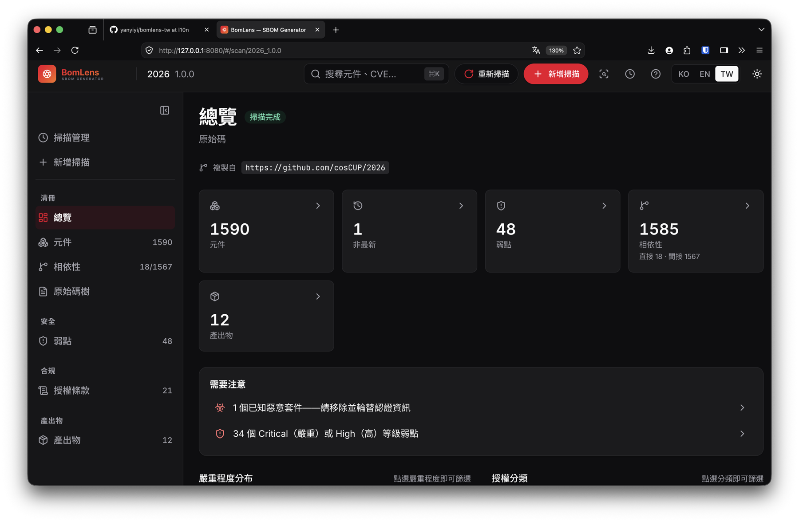
***BomLens 把每一個專案的元件、相依性、漏洞、授權與產出物集中在總覽頁，先讓使用者知道哪些地方需要注意。***

## 所謂讓「麻瓜」看懂，不是把風險說得很簡單

SBOM 是 Software Bill of Materials，也就是軟體物料清單。它記錄軟體使用了哪些元件、版本及相關資訊。有了這份清單，組織才能進一步確認元件是否存在已知漏洞、授權條件是否需要處理，以及供應商提供的資料是否完整。

但擁有一份清單，不等於已經看懂它。BomLens 可以從本機資料夾、GitHub URL、ZIP、容器映像、建置產出物、韌體、既有的 SBOM 或 AI 模型進行分析，也能產生 CycloneDX SBOM、開放原始碼聲明，以及資安與授權風險報告。使用者可以從桌面程式或瀏覽器介面操作，不一定得先從命令列開始。

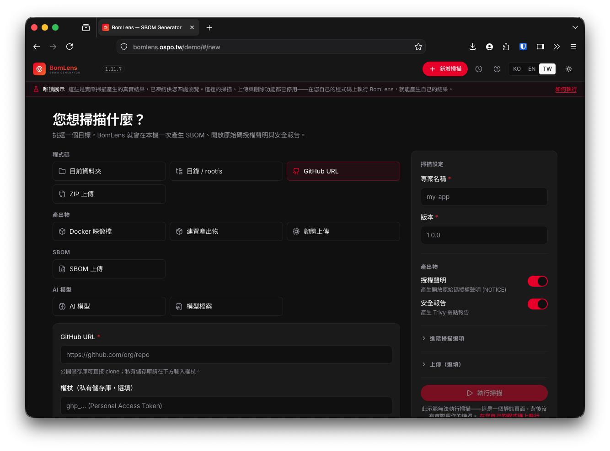
***BomLens 可以掃描的資源很豐富，包含本機原始碼、容器、韌體、既有 SBOM 與 AI 模型，甚至可以直接輸入 GitHub URL。***

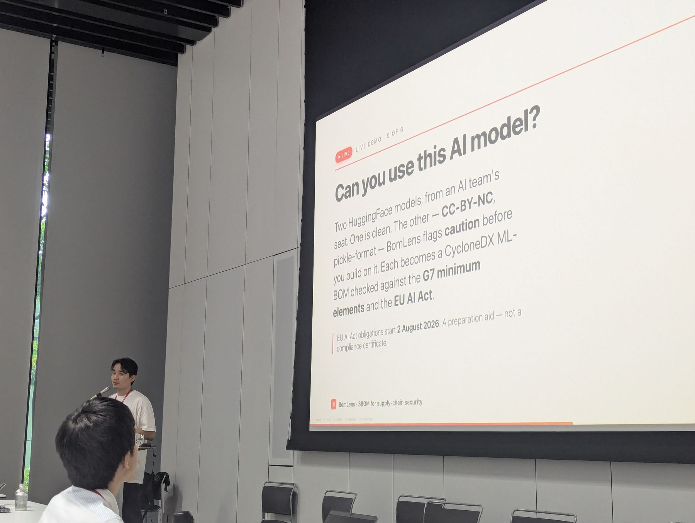
***BomLens 在現場也示範 AI 模型的使用情境：協助使用者查看模型授權與必要資料，並產生 CycloneDX ML-BOM。這些結果是採用模型前的準備資訊，不是合規認證。***

結果頁面會先整理元件數量、漏洞嚴重程度、授權分類與需要注意的項目，再讓使用者往下查看相依關係、漏洞資訊與授權細節。這裡所說的「麻瓜也能看懂」，不是把複雜風險假裝得很簡單，而是替不熟悉 SBOM 的人安排一個能開始閱讀的入口。

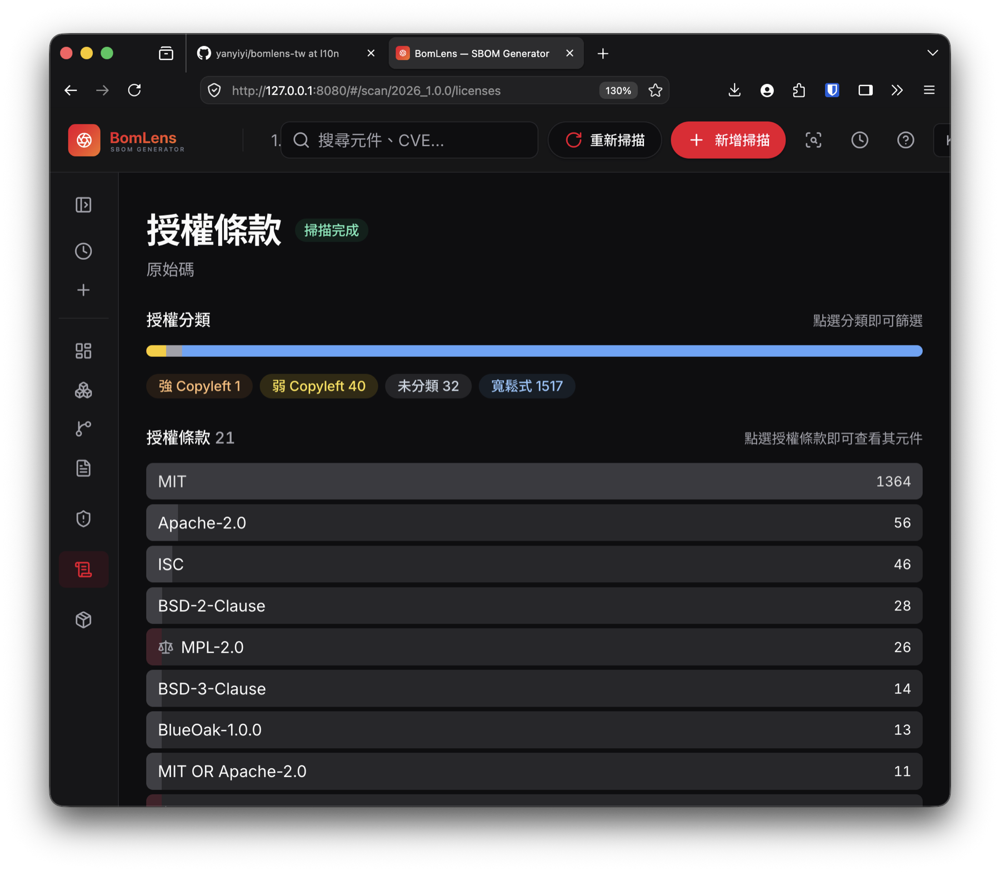
***BomLens 以圖像化方式整理專案內的授權分類與元件數量，讓使用者看見整體狀態，也能再點進去查看細節。***

掃描後產生的成果也不只留在畫面上。BomLens 會以 CycloneDX JSON 產生 SBOM，需要時也能匯出 SPDX 2.3；同時整理專案應附上的開放原始碼授權聲明，提供 HTML 與純文字版本。這些都是讓盤點結果能進入交付與管理流程的實用產出。

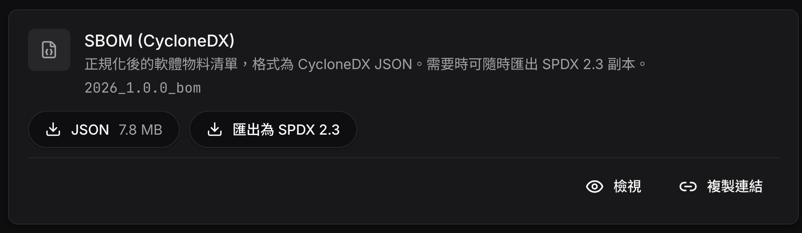
***BomLens 以 CycloneDX JSON 產生 SBOM，需要時也可以匯出 SPDX 2.3，方便接到不同的交付與管理流程。***

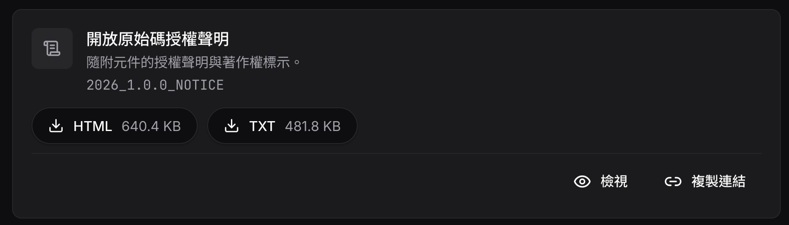
***BomLens 也會整理專案應附上的開放原始碼授權聲明（NOTICE），並提供 HTML 與純文字格式。***

BomLens 也不會替公司宣布「已經合規」。它更像一支放大鏡：把 SBOM 缺少什麼、哪些漏洞需要處理、哪些授權值得再確認，先攤到使用者眼前。如何修正、接受或追蹤這些風險，仍然需要組織自己判斷。

例如，它可以依照美國網路安全暨基礎設施安全局（CISA）提出的 SBOM 最低要素逐項比對，顯示目前具備幾項、缺少什麼，以及可能的補充方式。這是協助使用者檢查資料的建議，不代表通過或未通過合規判定；最後仍要回到提交方與接收方的實際要求。

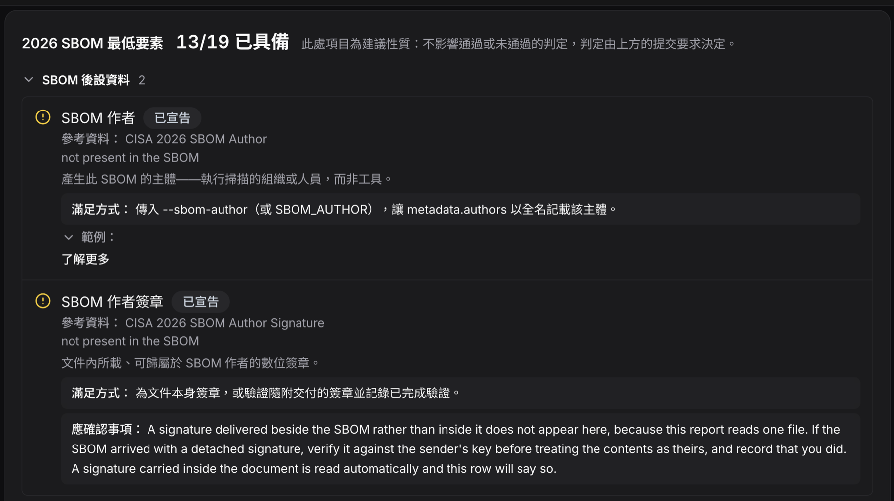
***BomLens 可以比對 CISA 的 SBOM 最低要素，指出缺少的資料與補充方式；畫面也明確提醒，結果屬於建議，不是合規判定。***

## 從供應商的一份 SBOM，到公司的治理流程

在分享中，Haksung 也示範了 BomLens 如何從個人手上的工具，接到組織層級的治理。

如果收到的是別人產生的 SBOM，也可以直接提交給 BomLens 分析。它會保留原本格式，整理檔案的基本資訊，並讓使用者繼續查看其中的元件、授權與風險；這正好對應供應鏈裡「收到一份 SBOM，接下來怎麼讀」的需要。

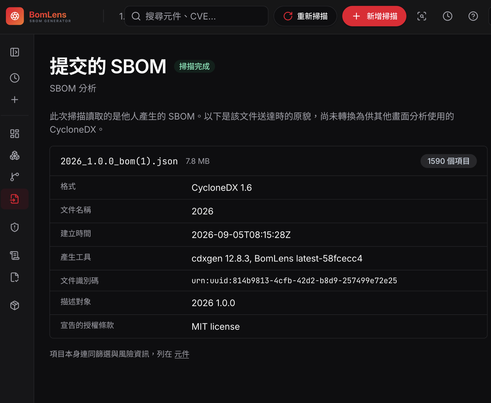
***收到供應商或其他工具產生的 SBOM，也可以提交給 BomLens 分析，查看格式、元件、授權及合規相關資訊。***

BomLens 採取 local-first 的設計，不需要帳號或遠端伺服器，掃描內容也不會上傳到 SaaS 平台。它在個人電腦上負責產生 SBOM 與初步判讀，再透過標準的 CycloneDX 格式，把結果交給公司使用的集中管理平台。

現場示範串接的是 TrustedOSS 的 [TRUSCA](https://github.com/trustedoss/trusca)。兩項工具的分工主要在於：BomLens 負責在單一專案產生 SBOM、整理風險；TRUSCA 則負責公司內不同專案與供應商的集中管理、漏洞判讀、授權政策及歷史紀錄。BomLens 目前也能將結果送往 TRUSCA 或 Dependency-Track 等管理系統。

如果放回供應鏈情境，可以看到兩次重要的銜接：供應商可以用 BomLens 整理交付軟體的元件資訊，客戶也能用它分析收到的 SBOM；進一步需要跨專案管理時，再把標準化結果送進公司的治理平台。

這也讓「要求供應商交 SBOM」不只是新增一項交付文件。企業還可以一起提供工具、範例與學習資源，讓供應商知道怎麼產生、怎麼檢查，也知道資料交出去之後會如何被使用。同時這套工具雖然在個人端執行，但也有和上游廠商交付掃瞄對接管理的可能性。

## OpenChain 社群裡長出來的實作工具

Haksung Jang 除了擔任 SK Telecom 的 OSPO Manager，也長期參與 [OpenChain Korea Work Group](https://openchainproject.org/featured/2021/03/16/openchain-korea-wg-9)。OpenChain 是 Linux Foundation 旗下推動開放原始碼供應鏈信任的專案，透過標準與各地工作小組，讓企業實務者交換授權合規、安全治理與供應鏈協作的方法。

我認為 BomLens 很能反映這種社群連結的價值。它不是只為 SK Telecom 內部留下的一套工具，而是以 Apache-2.0 授權開放出來，讓其他企業、供應商與開發者也能使用及改進。標準讓 SBOM 可以繼續往組織平台流動，開源則讓工具本身也能繼續往不同地區與使用情境延伸。

## 先試用，再一起把正體中文變得更好懂

如果還沒有使用過 BomLens，可以先打開[線上 DEMO](https://sktelecom.github.io/bomlens/demo/)、[線上 DEMO （目前中文版）](https://bomlens.ospo.tw/demo/)，查看已完成的掃描結果。示範站只提供閱讀；要掃描自己的專案，可以依照[官方入門文件](https://github.com/sktelecom/bomlens)安裝桌面程式或使用容器環境。

OCF 也建了一個 [BomLens 的 Weblate 正體中文在地化專案](https://translate.codeberg.org/projects/bomlens-taiwan/)。也歡迎熟悉 SBOM、資安或授權的朋友，可以協助確認技術意思；如果你是第一次接觸 SBOM，也可以幫忙指出哪些文字看不懂、哪些地方不知道下一步該做什麼。

回國後，我一直向不同夥伴推薦 BomLens，正是因為它讓 SBOM 不再只是一份被要求繳交的檔案。從個人第一次看懂風險，到公司逐步建立管理流程，都有一個可以實際動手的入口。接下來，也邀請大家一起讓這個入口更適合台灣的使用者。

## 開源治理系列專文

* [#01 OCF 正式加入 OSPO 聯盟！開源治理手冊是什麼？](https://ocf.tw/story/ospos-1-join-OSPO-alliance/)
* [#02 OSPO 正在集結中！來自世界各地的政府開源專案辦公室](https://ocf.tw/story/ospos-2-floss-pso-intl-network/)
* [#03 2026 Q1 開源合規與安全調查報告：臺灣企業準備好了嗎？](https://ocf.tw/story/ospos-3-taiwan-open-compliance-security-report-2026-q1/)
* [#04 開源不只是技術選擇：AI 時代企業布局國際競爭力的起點](https://ocf.tw/story/open-source-business-ai-competitiveness-2026/)
* [#05 OCF 前進 Sony 總部：台灣開源治理推動經驗如何與亞洲接軌？](https://ocf.tw/story/ospos-5-ospology-asia-sony-2026/)
* [#06 串連社群、產業和政府：OCF 在 OSPOlogy Asia 2026 的分享紀實](https://ocf.tw/story/ospos-6-start-before-formal-ospo/)
* [#07 AI 時代的企業開源備忘錄：亞洲協作趨勢、歐盟供應鏈規範到 17 年實戰](https://ocf.tw/story/ospos-7-enterprise-open-source-memo-2026/)
* [#08 從「和」到一套能直接使用的文件：日本如何以 OSPO Starter Kit 支持產業](https://ocf.tw/story/ospos-8-japan-ospo-starter-kit/)
* [#09 讓麻瓜也看懂 SBOM：韓國 BomLens 如何從個人手上的風險介接到公司治理](https://ocf.tw/story/ospos-9-korea-bomlens/)

## 延伸閱讀與參與

* [BomLens 上游專案與使用文件](https://github.com/sktelecom/bomlens)
* [Haksung Jang 的 OSPOlogy Asia 分享簡報](https://sktelecom.github.io/bomlens/talks/ospology-asia-2026-tokyo/slides.html)
* [一起參與 BomLens 正體中文在地化](https://translate.codeberg.org/projects/bomlens-taiwan/)
